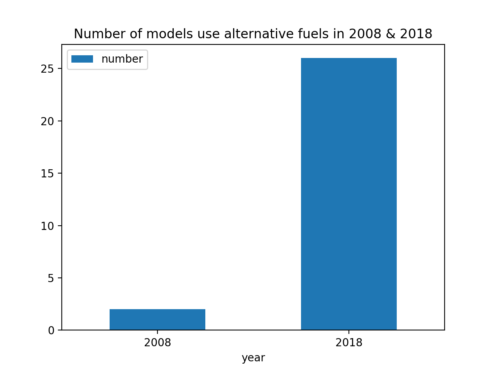
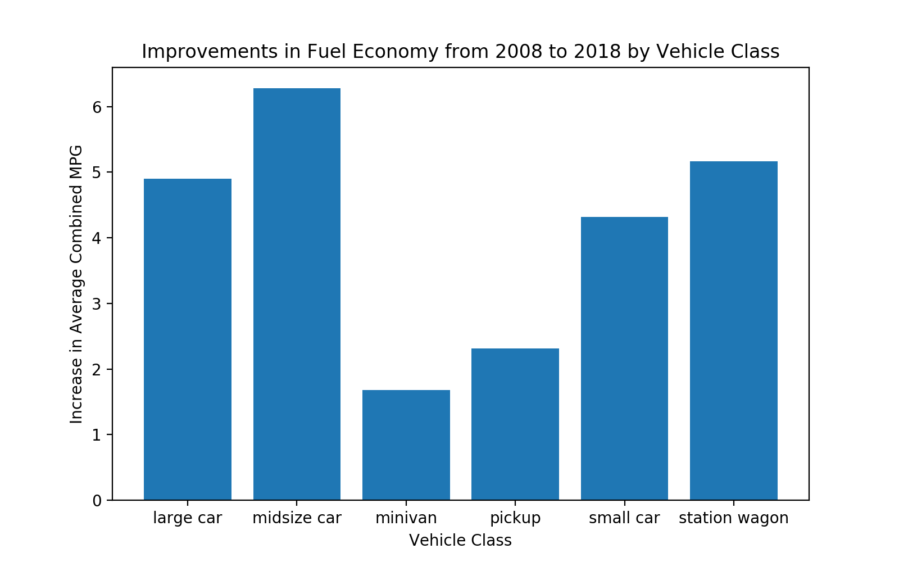
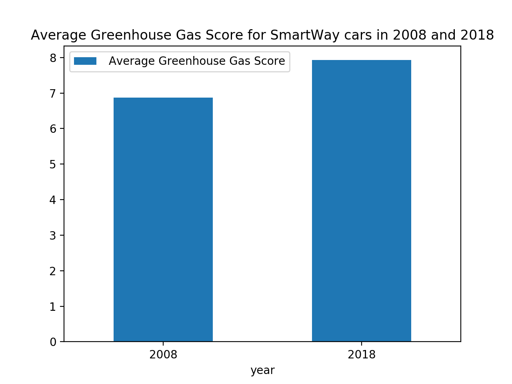
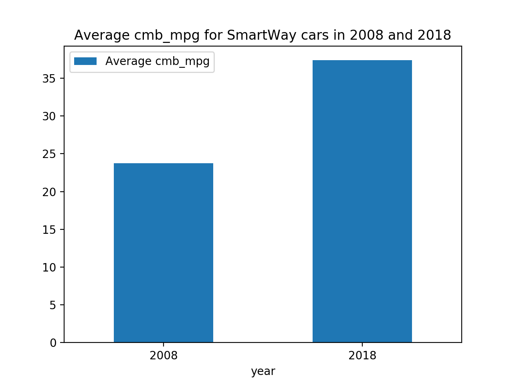

# Fuel_Economy_Data
analyzing fuel economy data for different car models from 2008 and 2018

When comparing the distributions of greenhouse gas score in 2008 and 2018, we can see the distribution for 2008 is more skewed to the left.

The distribution of combined miles per gallon from 2008 to 2018 shows us that it became much more skewed to the right in the light of the introduction of electrical/hybrids vehicles

There is a negative correlation between displacement and comboned mpg. This inversely proportional correlation occurred in both 2008 and 2018. The graph below shows this indirect correlation

There is a positive correlation between greenhouse gas score and combined mpg. This direct relation occurred in both 2008 and 2018. 

The alternative sources of fuel available in 2008 are CNG and ethanol whilst those in 2018 ethanol and electricity. Since 2008, the number of unique models using alternative sources of fuel increased by 24. We can also look at proportions:

Over ten years, vehicle classes improved in fuel economy. It is demonstrated by the increase of combined miles per gallon each class performs in 2018. Due to the re-definition of car models and vehicle classes, some sorts of cars have no information. The other ones are displayed as follows:

The characteristics of SmartWay vehicles are demonstrated via 2 important factors of cmb_mpg and Greenhouse Gas Score. Throughout ten years, we can see there is an improvement in which the new generation of SmartWay vehicles can travel longer distance and generate less emission as follows:

