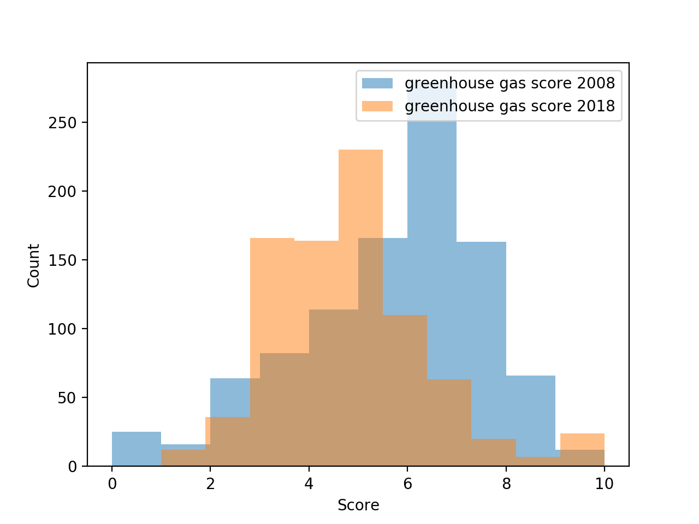
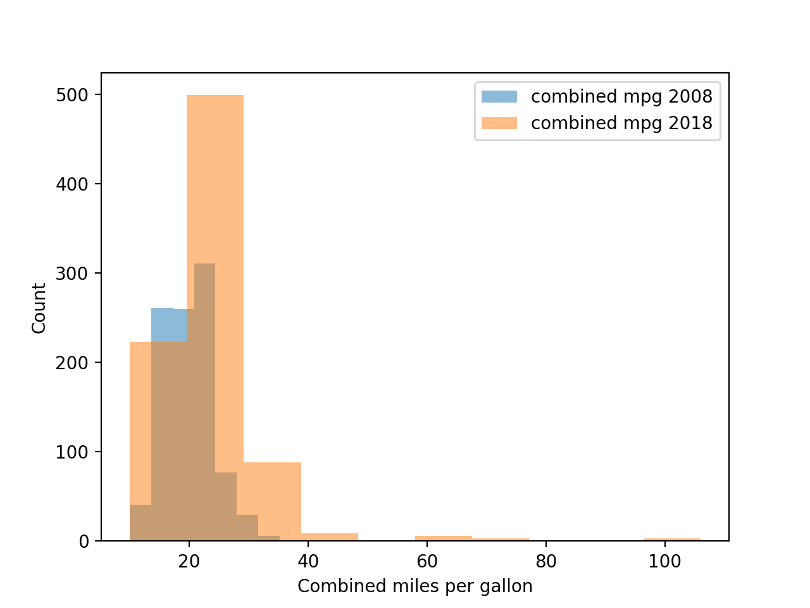
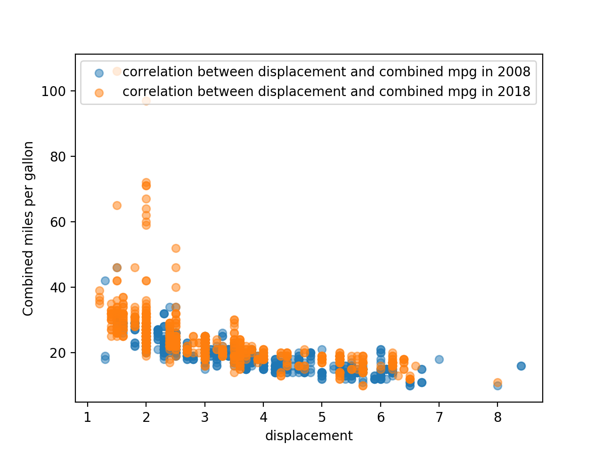
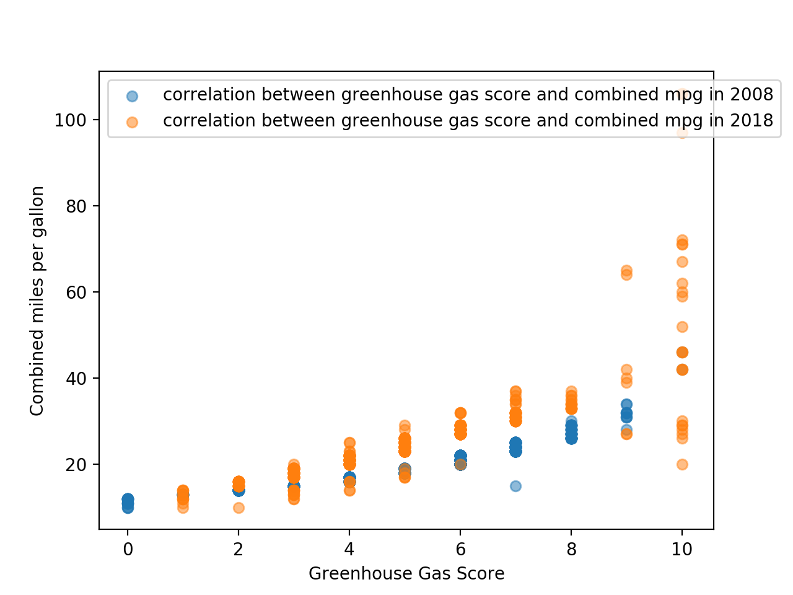

# Fuel_Economy_Data
analyzing fuel economy data for different car models from 2008 and 2018

When comparing the distributions of greenhouse gas score in 2008 and 2018, we can see the distribution for 2008 is more skewed to the left.

The distribution of combined miles per gallon from 2008 to 2018 shows us that it became much more skewed to the right in the light of the introduction of electrical/hybrids vehicles

There is a negative correlation between displacement and comboned mpg. This inversely proportional correlation occurred in both 2008 and 2018. The graph below shows this indirect correlation

There is a positive correlation between greenhouse gas score and combined mpg. This direct relation occurred in both 2008 and 2018. 
